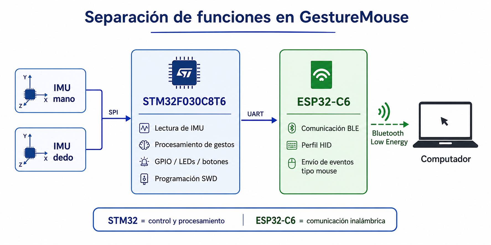
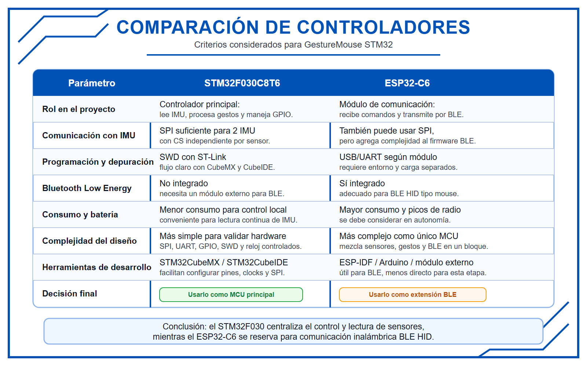
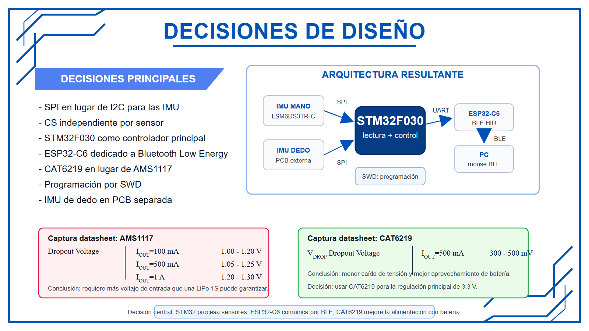
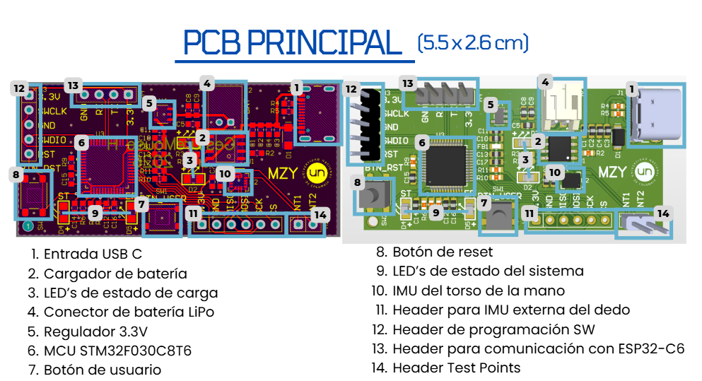
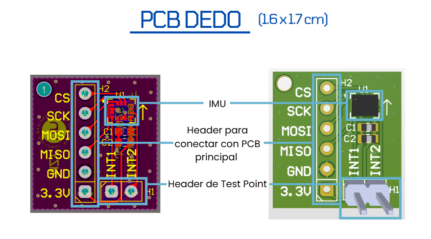

# Nota de Aplicación Final: GestureMouse STM32

Guía técnica del producto final para un guante controlador gestual basado en STM32, sensores IMU y comunicación Bluetooth Low Energy.

---

## Resumen

**GestureMouse STM32** es un sistema embebido portátil tipo guante, diseñado para detectar movimientos de la mano y de un dedo mediante sensores inerciales IMU. El sistema utiliza un **STM32F030C8T6** como microcontrolador principal para leer las IMU mediante comunicación SPI, procesar la información de movimiento y servir como base para generar acciones tipo mouse.

La comunicación inalámbrica se plantea mediante un **ESP32-C6**, usado como módulo dedicado a Bluetooth Low Energy. De esta forma, el STM32F030 se encarga del control local, lectura de sensores y procesamiento inicial de gestos, mientras que el ESP32-C6 permite transmitir los comandos al computador como eventos tipo mouse.

Esta nota de aplicación describe la arquitectura del producto final, los criterios de diseño electrónico, los bloques de hardware, la distribución de potencia, la separación de la PCB del dedo y el procedimiento recomendado para validar el prototipo.

---

## Objetivo De La Nota De Aplicación

El objetivo de este documento es presentar el diseño final del sistema GestureMouse STM32 desde un enfoque técnico y aplicado. A diferencia del informe final del proyecto, esta nota no se centra en narrar todo el proceso de desarrollo, sino en explicar cómo está diseñado el producto, qué decisiones técnicas se tomaron y cómo debería validarse el sistema.

Este documento puede utilizarse como guía para comprender, fabricar, ensamblar y probar una primera versión funcional del guante controlador gestual.

---

## Descripción General Del Producto

El producto final propuesto es un guante controlador gestual capaz de interpretar movimientos de la mano y del dedo para generar acciones tipo mouse. La PCB principal se ubica en el dorso de la mano y contiene el microcontrolador, la entrada de alimentación, el cargador de batería, el regulador de voltaje, la IMU principal, botones, LEDs y conectores de programación/comunicación.

La IMU del dedo se ubica en una PCB secundaria para medir directamente el movimiento del dedo. Esta separación permite que cada sensor mida el movimiento correspondiente:

- La **IMU de la mano** registra orientación, inclinación y movimiento general.
- La **IMU del dedo** registra movimientos específicos del dedo para gestos como clic, selección o activación.

El sistema está pensado para funcionar con batería LiPo, cargarse mediante USB-C y comunicarse con el computador mediante Bluetooth Low Energy usando un ESP32-C6.

---

## Caso De Uso

GestureMouse STM32 está orientado a aplicaciones donde el usuario necesita controlar un computador o dispositivo sin usar un mouse físico tradicional.

Ejemplos de uso previstos:

- Movimiento de mano para desplazar el cursor.
- Movimiento del dedo para generar clic.
- Gestos sostenidos para arrastre.
- Inclinaciones o movimientos específicos para scroll.
- Uso como interfaz de accesibilidad.
- Control de presentaciones o sistemas remotos.

Aunque la implementación completa de gestos depende del firmware final, la arquitectura propuesta deja preparada la base de hardware necesaria para desarrollar estas funciones.

---

## Requerimientos Del Sistema

Para cumplir con la aplicación propuesta, el sistema debe considerar los siguientes requerimientos:

- Alimentación portátil mediante batería LiPo.
- Entrada USB-C para carga de batería.
- Regulación estable a 3.3 V.
- Lectura de sensores IMU mediante SPI.
- Programación del microcontrolador mediante SWD.
- Comunicación UART entre STM32F030 y ESP32-C6.
- Comunicación inalámbrica mediante Bluetooth Low Energy.
- PCB secundaria para ubicar la IMU del dedo.
- Diseño modular y fácil de validar por bloques.
- Consumo adecuado para una aplicación portátil.
- Posibilidad de integración futura con firmware de gestos y BLE HID.

---

## Arquitectura General Del Sistema

La arquitectura del sistema se basa en separar el procesamiento local de sensores y la comunicación inalámbrica. El STM32F030 se encarga de leer las IMU, procesar los movimientos y controlar las señales del sistema. El ESP32-C6 se utiliza como módulo dedicado a Bluetooth Low Energy.

```text
IMU mano + IMU dedo
        |
        | SPI
        v
STM32F030C8T6
        |
        | UART
        v
ESP32-C6
        |
        | Bluetooth Low Energy
        v
Computador
```

Documento relacionado:

- [Diagramas de bloques de hardware y firmware](<../Fase3_Diagramas/DiagramasBloques.pdf>)



---

## Selección Del Controlador Principal

Se decidió utilizar el **STM32F030C8T6** como microcontrolador principal porque permite centralizar la lectura de las IMU, el manejo de GPIO, la comunicación SPI, la comunicación UART y la programación mediante SWD.

Además, su configuración desde STM32CubeMX y STM32CubeIDE facilita la validación inicial del hardware, especialmente en una primera PCB donde es importante comprobar alimentación, pines, periféricos y comunicación con sensores.

El **ESP32-C6** se mantiene dentro del sistema, pero como módulo dedicado a la comunicación Bluetooth Low Energy. De esta forma, el STM32F030 se encarga del control y procesamiento local, mientras que el ESP32-C6 recibe comandos por UART y los transmite al computador como eventos tipo mouse.

Decisión final:

- **STM32F030:** lectura de sensores, procesamiento inicial, control de GPIO, LEDs, botones y programación SWD.
- **ESP32-C6:** comunicación inalámbrica Bluetooth Low Energy y posible perfil HID tipo mouse.


---

## Principio De Funcionamiento De La IMU

Una IMU, o unidad de medición inercial, integra sensores MEMS capaces de medir movimiento en varios ejes. En este proyecto se utiliza la **LSM6DS3TR-C**, que combina:

- Acelerómetro de 3 ejes.
- Giroscopio de 3 ejes.

El acelerómetro mide aceleración lineal en los ejes X, Y y Z. Cuando el sensor está quieto, también permite estimar inclinación respecto a la gravedad.

El giroscopio mide velocidad angular, lo que permite detectar rotaciones y movimientos rápidos.

Al combinar ambas mediciones, el sistema puede identificar movimientos de la mano y del dedo, que posteriormente pueden interpretarse como gestos asociados a acciones tipo mouse.

---

## Diseño De Hardware Por Bloques

El sistema se organizó por bloques para facilitar el diseño, revisión y validación del hardware.

---

### Entrada USB-C

Este bloque recibe 5 V desde el puerto USB-C. En este proyecto el USB-C se usa únicamente para alimentación y carga de batería, por lo que no se utilizan las líneas diferenciales de datos USB.

Las resistencias de 5.1 kΩ en CC1 y CC2 permiten que una fuente USB-C reconozca la tarjeta como dispositivo consumidor de energía.

Funciones principales:

- Recibir alimentación de 5 V.
- Permitir carga de batería.
- Identificar la PCB como dispositivo consumidor USB-C.
- Filtrar ruido básico en la entrada.

Documento relacionado:

- [Datasheet USB TYPE-C-3.1-16PIN](https://www.lcsc.com/datasheet/C7507405.pdf)

---

### Cargador De Batería LiPo

Este bloque controla la carga de la batería LiPo a partir de la entrada USB-C. Incluye LEDs indicadores de estado de carga y una resistencia de programación para definir la corriente de carga.

Con una resistencia de programación de 3.3 kΩ, la corriente aproximada de carga es:

```text
I_CHG = 1200 / R_PROG
I_CHG = 1200 / 3.3
I_CHG ≈ 364 mA
```

Este valor es adecuado para una batería LiPo de 1000 mAh, ya que corresponde aproximadamente a 0.36 C.

Funciones principales:

- Cargar la batería LiPo desde USB-C.
- Limitar la corriente de carga.
- Indicar estado de carga mediante LEDs.
- Entregar el nodo BAT+ hacia el regulador.

Documento relacionado:

- [Datasheet TPB4056A](https://static.3peak.com/res/doc/ds/Datasheet_TPB4056A.pdf)

---

### Regulación De 3.3 V

Este bloque genera la alimentación principal del sistema. Inicialmente se consideró el regulador AMS1117-3.3, pero se descartó debido a su alto voltaje de dropout para una aplicación alimentada con batería LiPo.

Una batería LiPo de una celda tiene aproximadamente:

```text
4.2 V completamente cargada
3.7 V nominal
```

El AMS1117 puede requerir alrededor de 4.4 V para garantizar una salida estable de 3.3 V, por lo que no aprovecha correctamente el rango útil de la batería.

Por esta razón se seleccionó el **CAT6219**, un LDO de bajo dropout. Este regulador permite mantener una salida cercana a 3.3 V durante una mayor parte de la descarga de la batería.

Funciones principales:

- Convertir BAT+ a 3.3 V.
- Alimentar STM32, IMU y circuitos digitales.
- Mejorar el aprovechamiento de la batería LiPo.
- Reducir riesgo de caída temprana de tensión.

Documentos relacionados:

- [Datasheet AMS1117](https://mm.digikey.com/Volume0/opasdata/d220001/medias/docus/5011/AMS1117.pdf)
- [Datasheet CAT6219](https://www.lcsc.com/datasheet/C255621.pdf)

Imagen sugerida:



---

### Alimentación Del STM32

Este bloque incluye la conexión de los pines VDD, VDDA, VSS y VSSA del microcontrolador, además de capacitores de desacople cercanos a los pines de alimentación.

Los capacitores de 0.1 uF deben ubicarse lo más cerca posible de los pines del microcontrolador, ya que ayudan a reducir ruido local y estabilizar la alimentación durante cambios rápidos de corriente.

Funciones principales:

- Alimentar el núcleo digital del STM32.
- Alimentar el dominio analógico VDDA.
- Desacoplar ruido de alimentación.
- Mejorar estabilidad de operación.

---

### Microcontrolador STM32F030

Este bloque contiene el controlador principal del sistema. Sus funciones son:

- Leer las IMU mediante SPI.
- Controlar señales de chip select independientes.
- Manejar LEDs y botones.
- Permitir programación por SWD.
- Comunicarse por UART con el ESP32-C6.

Documento relacionado:

- [Datasheet STM32F030](https://www.st.com/resource/en/datasheet/stm32f030f4.pdf)

---

### Sensores IMU

Las IMU se conectan mediante SPI. La IMU de la mano se ubica en la PCB principal y la IMU del dedo se ubica en una PCB secundaria.

La comunicación SPI utiliza las señales:

- **SCK:** reloj de comunicación.
- **MOSI:** datos desde STM32 hacia IMU.
- **MISO:** datos desde IMU hacia STM32.
- **CS:** selección individual de cada IMU.

Documento relacionado:

- [Datasheet IMU LSM6DS3TR-C](https://www.lcsc.com/datasheet/C967633.pdf)

---

### Comunicación Con ESP32-C6

El ESP32-C6 se conecta al STM32 mediante UART. Su función principal es recibir comandos desde el STM32 y transmitirlos al computador mediante Bluetooth Low Energy.

Esta decisión permite que el STM32 se enfoque en el control local y que el ESP32-C6 se encargue únicamente de la comunicación inalámbrica.

Documento relacionado:

- [Datasheet ESP32-C6](https://documentation.espressif.com/esp32-c6_datasheet_en.pdf)

---

### Programación Y Depuración

La programación del STM32 se realiza mediante SWD usando las señales:

- SWDIO.
- SWCLK.
- NRST.
- 3.3 V.
- GND.

Este método permite cargar firmware y depurar el microcontrolador sin depender del ESP32-C6.

---

## Conexiones Principales Del Sistema

| Señal | Pin STM32F030 | Función |
|---|---|---|
| SPI1_SCK | PA5 | Reloj SPI para IMU |
| SPI1_MISO | PA6 | Datos desde IMU hacia STM32 |
| SPI1_MOSI | PA7 | Datos desde STM32 hacia IMU |
| USART1_TX | PA9 | Transmisión UART hacia ESP32-C6 |
| USART1_RX | PA10 | Recepción UART desde ESP32-C6 |
| SWDIO | PA13 | Programación y depuración |
| SWCLK | PA14 | Reloj de programación SWD |
| BTN_USER | PA0 | Botón de usuario |
| LED_STATUS | PC13 | Indicador de estado |
| LED_ERROR | PC14 | Indicador de error |

---

## Árbol De Potencia Y Consumo

El sistema recibe energía desde USB-C para cargar la batería LiPo. La batería alimenta el regulador de 3.3 V, y desde esta línea se alimentan el STM32, las IMU y el ESP32-C6.

```text
USB-C 5 V
   |
   +-- Cargador LiPo
           |
           +-- Batería LiPo 3.7 V
                   |
                   +-- Regulador 3.3 V
                           |
                           +-- STM32F030
                           +-- IMU mano
                           +-- IMU dedo
                           +-- ESP32-C6
```

Documento relacionado:

- [Árbol de potencia](<../Fase3_Diagramas/ÁrbolPotencia.pdf>)

### Consumo Estimado

| Bloque | Corriente aproximada |
|---|---:|
| Sistema base | 50 mA |
| ESP32-C6 promedio | 80 mA |
| Total promedio | 130 mA |
| ESP32-C6 pico | 200 mA |
| Total pico | 250 mA |

### Potencia Total

Con ESP32-C6 en consumo promedio:

```text
P = V * I
P = 3.3 V * 0.13 A
P = 0.429 W
```

Con ESP32-C6 en pico:

```text
P = 3.3 V * 0.25 A
P = 0.825 W
```

### Autonomía Ideal

Para una batería de 1000 mAh:

```text
Autonomía promedio = 1000 mAh / 130 mA = 7.7 h
Autonomía conservadora = 1000 mAh / 250 mA = 4 h
```

Estos valores son ideales y deben validarse experimentalmente, ya que la autonomía real depende del consumo final del firmware, el uso del ESP32-C6 y el comportamiento de la batería.

---

## Diseño De PCB

El proyecto contempla una PCB principal y una PCB secundaria para la IMU del dedo.

---

### PCB Principal

La PCB principal integra:

- Entrada USB-C.
- Cargador de batería LiPo.
- Regulador de 3.3 V.
- STM32F030C8T6.
- IMU de la mano.
- Headers de programación.
- Header UART hacia ESP32-C6.
- Header hacia la IMU externa del dedo.
- LEDs de estado.
- Botones de usuario y reset.

Documento relacionado:

- [Diseño de PCB](<../Fase4_PCB's/PCB's.pdf>)

Imagen sugerida:



---

### PCB Secundaria Para IMU Del Dedo

La PCB secundaria contiene la IMU del dedo, sus capacitores de desacople y el conector hacia la PCB principal. Esta separación permite medir el movimiento real del dedo y facilita la integración física en el guante.

La conexión entre la PCB principal y la PCB secundaria requiere:

- 3.3 V.
- GND.
- SCK.
- MOSI.
- MISO.
- CS de la IMU del dedo.



---

## Recomendaciones De Diseño PCB

Para mejorar la confiabilidad del diseño se recomienda:

- Ubicar el capacitor de 0.1 uF lo más cerca posible de los pines de alimentación de cada IC.
- Mantener las pistas SPI cortas y ordenadas.
- Usar un plano de GND continuo.
- Ubicar el regulador cerca de la entrada de alimentación del sistema.
- Colocar la IMU con orientación clara y documentada.
- Mantener el conector de la IMU externa accesible para cableado.
- Separar visualmente los bloques de alimentación, control y sensores.
- Evitar pistas largas innecesarias en señales de programación SWD.
- Usar anchos de pista mayores en alimentación que en señales digitales.

---

## Firmware Propuesto

El firmware inicial debe validar primero la lectura de sensores antes de implementar gestos completos.

```text
Inicio
  |
  v
Configuración de reloj
  |
  v
Inicialización GPIO
  |
  v
Inicialización SPI
  |
  v
Inicialización UART
  |
  v
Lectura de IMU
  |
  v
Validación de comunicación SPI
  |
  v
Lectura de acelerómetro y giroscopio
  |
  v
Filtrado básico
  |
  v
Interpretación de gestos
  |
  v
Envío de comandos por UART
```

Documento relacionado:

- [Diagramas de bloques de hardware y firmware](<../Fase3_Diagramas/DiagramasBloques.pdf>)

---

## Procedimiento De Validación Recomendado

La validación inicial debe realizarse en el siguiente orden:

1. Verificar continuidad y ausencia de cortos.
2. Alimentar por USB-C y revisar USB_5V.
3. Verificar carga de batería.
4. Medir salida de 3.3 V del regulador.
5. Verificar alimentación del STM32.
6. Programar el STM32 por SWD.
7. Inicializar SPI.
8. Revisar datos de la IMU de mano.
9. Revisar datos de la IMU de dedo.
10. Enviar datos por UART.
11. Probar movimiento de sensores.
12. Integrar ESP32-C6.
13. Implementar detección básica de gestos.
14. Probar comunicación Bluetooth Low Energy.

---

## Resultados Esperados

Al finalizar la fabricación y ensamble del prototipo, se espera obtener:

- Salida regulada estable de 3.3 V.
- Carga correcta de batería LiPo mediante USB-C.
- Programación correcta del STM32 mediante SWD.
- Comunicación SPI funcional con las IMU.
- Lectura de acelerómetro y giroscopio.
- Transmisión de datos por UART hacia el ESP32-C6.
- Base de hardware lista para implementar gestos.
- Preparación para comunicación Bluetooth HID.

Estos resultados permitirán avanzar hacia la implementación del mouse gestual inalámbrico.

---

## Aplicaciones Posibles

El sistema puede utilizarse como base para:

- Mouse gestual.
- Control de presentaciones.
- Interfaces de accesibilidad.
- Control remoto de dispositivos.
- Interfaces para realidad virtual o aumentada.
- Control de sistemas robóticos.
- Interacción humano-máquina sin contacto directo.

---

## Limitaciones Y Consideraciones

El diseño propuesto aún requiere fabricación, ensamble y validación experimental. Algunas consideraciones importantes son:

- La comunicación BLE HID debe integrarse con el ESP32-C6.
- El reconocimiento de gestos requiere desarrollo de firmware adicional.
- La IMU en encapsulado LGA puede ser difícil de soldar manualmente.
- La autonomía real de la batería debe medirse experimentalmente.
- Se recomienda utilizar una batería LiPo con protección.
- El cargador de batería no reemplaza un sistema completo de power-path.
- El consumo del ESP32-C6 puede variar según el modo de operación BLE.
- La orientación física de las IMU debe documentarse para facilitar el procesamiento de gestos.

---

## Trabajo Futuro

Como continuación del proyecto se propone:

- Fabricar la PCB principal y la PCB de dedo.
- Ensamblar componentes.
- Validar alimentación y consumo real.
- Programar firmware base en STM32.
- Leer correctamente las IMU mediante SPI.
- Implementar filtros digitales.
- Implementar reconocimiento de gestos.
- Integrar ESP32-C6 para BLE HID.
- Lograr que el computador reconozca el sistema como mouse inalámbrico.
- Mejorar ergonomía e integración física en el guante.

---

## Conclusión

GestureMouse STM32 presenta una arquitectura modular para un guante controlador gestual basado en sensores IMU. La separación entre el STM32F030 como controlador principal y el ESP32-C6 como módulo Bluetooth permite distribuir funciones de forma clara, reduciendo la complejidad del firmware principal.

El diseño por bloques facilita la validación del hardware, desde la alimentación y regulación hasta la lectura de sensores y la comunicación externa. La PCB secundaria para la IMU del dedo permite adaptar el sistema a la forma física del guante y mejorar la medición del movimiento.

En conjunto, el diseño propuesto constituye una base técnica sólida para fabricar, ensamblar y validar un prototipo funcional de mouse gestual inalámbrico.

---

## Referencias

- Advanced Monolithic Systems. (s. f.). *AMS1117 Voltage Regulator Datasheet*. Digi-Key. https://mm.digikey.com/Volume0/opasdata/d220001/medias/docus/5011/AMS1117.pdf
- 3PEAK. (s. f.). *TPB4056A Linear Li-Ion Battery Charger Datasheet*. 3PEAK. https://static.3peak.com/res/doc/ds/Datasheet_TPB4056A.pdf
- Espressif Systems. (s. f.). *ESP32-C6 Series Datasheet*. Espressif. https://documentation.espressif.com/esp32-c6_datasheet_en.pdf
- MANUS. (s. f.). *MANUS products: Professional glove-based motion capture systems*. MANUS. https://www.manus-meta.com/products/overview
- Mariana-zy. (2026). *fp-sns-allmems1: Prototipo con SensorTile y firmware ALLMEMS1* [Repositorio de GitHub]. GitHub. https://github.com/Mariana-zy/fp-sns-allmems1
- Mariana-zy. (2026). *GestureMouse-STM32: Diseño de PCB y documentación de un guante controlador gestual* [Repositorio de GitHub]. GitHub. https://github.com/Mariana-zy/GestureMouse-STM32
- onsemi. (s. f.). *CAT6219 500 mA CMOS Low Dropout Regulator Datasheet*. LCSC. https://www.lcsc.com/datasheet/C255621.pdf
- SHOU HAN. (s. f.). *USB TYPE-C-3.1-16PIN Datasheet*. LCSC. https://www.lcsc.com/datasheet/C7507405.pdf
- STMicroelectronics. (2019). *UM2101: Getting started with the STEVAL-STLKT01V1 SensorTile integrated development platform*. STMicroelectronics. https://www.st.com/resource/en/user_manual/um2101-getting-started-with-the-stevalstlkt01v1-sensortile-integrated-development-platform-stmicroelectronics.pdf
- STMicroelectronics. (s. f.). *FP-SNS-ALLMEMS1: STM32Cube function pack for IoT node with Bluetooth Low Energy connectivity, digital microphone, environmental, and motion sensors*. STMicroelectronics. https://www.st.com/en/embedded-software/fp-sns-allmems1.html
- STMicroelectronics. (s. f.). *LSM6DS3TR-C iNEMO Inertial Module Datasheet*. LCSC. https://www.lcsc.com/datasheet/C967633.pdf
- STMicroelectronics. (s. f.). *STBLESensor: BLE sensor application for Android and iOS*. STMicroelectronics. https://www.st.com/en/embedded-software/stblesensor.html
- STMicroelectronics. (s. f.). *STM32CubeIDE*. STMicroelectronics. https://www.st.com/en/development-tools/stm32cubeide.html
- STMicroelectronics. (s. f.). *STM32CubeMX*. STMicroelectronics. https://www.st.com/en/development-tools/stm32cubemx.html
- STMicroelectronics. (s. f.). *STM32CubeProgrammer software description*. STMicroelectronics. https://www.st.com/resource/en/user_manual/dm00403500-stm32cubeprogrammer-software-description-stmicroelectronics.pdf
- STMicroelectronics. (s. f.). *STM32F030x4/x6/x8/xC Datasheet*. STMicroelectronics. https://www.st.com/resource/en/datasheet/stm32f030f4.pdf
- YouTube. (s. f.). *Video de inspiración para el proyecto de guante/controlador gestual*. YouTube. https://www.youtube.com/watch?v=LUPaY_fYAWU
